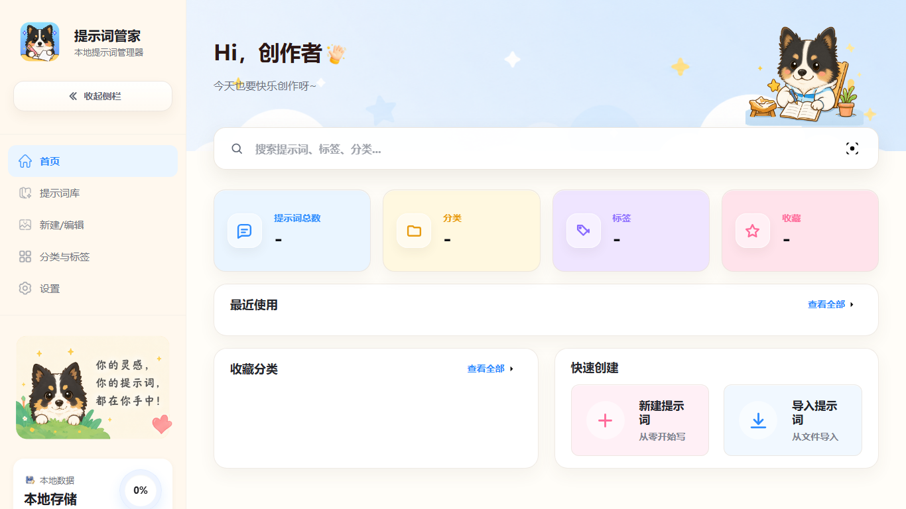
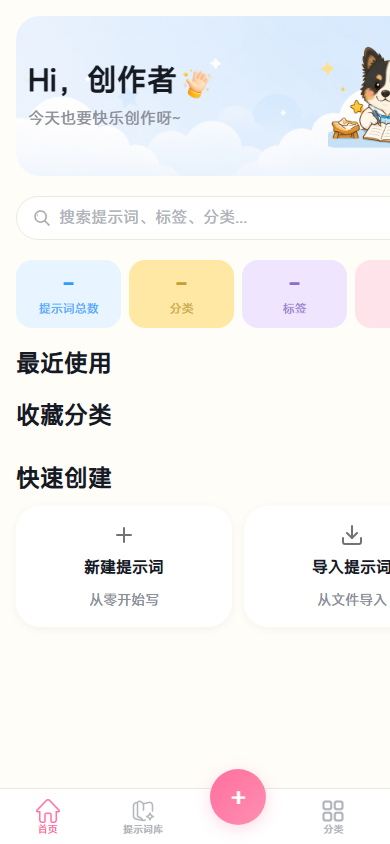

# 提示词管家 PromptImageManager

<p align="center">
  
</p>

<p align="center">
  <strong>面向 AI 生图工作流的本地提示词与图片管理工具</strong>
</p>

<p align="center">
  管理提示词、参考图片、分类标签和版本记录，支持 Windows 桌面端与 Android 端在局域网内同步数据。
</p>

<p align="center">
  <a href="https://github.com/LKC218/prompt-image-tool/releases">
    
  </a>
  
  
  
</p>

## 界面预览

| PC 端首页 | 移动端首页 |
| --- | --- |
|  |  |

## 核心功能

| 能力 | 说明 |
| --- | --- |
| 提示词库 | 保存、搜索、编辑和复用正向提示词、反向提示词与创作参数 |
| 分类与标签 | 使用分类、颜色和标签整理不同项目、风格、场景和用途 |
| 图片管理 | 为提示词绑定封面图、参考图和本地图片资源 |
| 版本记录 | 保留提示词修改历史，方便回溯和复用旧版本 |
| 数据备份 | 支持本地数据导入、导出、备份和迁移 |
| 局域网同步 | 支持 PC 与 Android 拉取、回传和双向同步 |
| 跨端发布 | 提供 Windows 安装包、Android 安装包和 Web 开发运行方式 |

## 下载

普通用户建议直接下载发布版，无需手动安装 Python 或前端依赖。

- [前往 GitHub Releases 下载](https://github.com/LKC218/prompt-image-tool/releases)
- Windows：下载 `PromptImageManager-Setup-版本号.exe`
- Android：下载 `PromptImageManager-v版本号-Android.apk`

Android 首次安装时，如果系统拦截 APK，请在系统设置中允许当前浏览器或文件管理器安装未知来源应用。

## 快速开始

前端开发运行：

```powershell
npm install
npm run dev
```

Python 后端运行：

```powershell
pip install -r requirements.txt
python python\main.py
```

PC 独立安装包构建：

```powershell
python scripts\build_pc_package.py
```

Android 安装包构建：

```powershell
python scripts\build_android_package.py
```

PC 与 Android 发布包一键构建：

```powershell
python scripts\build_release_packages.py
```

Windows 一键启动：

- 双击 [`一键启动-服务器和网页.bat`](./一键启动-%E6%9C%8D%E5%8A%A1%E5%99%A8%E5%92%8C%E7%BD%91%E9%A1%B5.bat)

## 局域网同步

提示词管家支持同一局域网内的 PC 与 Android 数据互通：

- Android 从 PC 拉取提示词数据。
- Android 回传数据到 PC。
- 双端执行双向同步。
- PC 默认优先使用 `8888` 端口，占用时顺序回退到 `8889-8897`。
- 移动端支持 `IP`、`IP:端口` 和 `http://IP:端口` 三种连接写法。

## 目录说明

| 路径 | 职责 |
| --- | --- |
| `src/` | 前端源码、样式、交互脚本和运行时资源 |
| `python/` | Python 后端、接口和测试 |
| `src-tauri/` | Tauri 桌面端工程 |
| `android/` | Capacitor Android 原生工程 |
| `installer-shell/` | Tauri 自定义安装器壳工程 |
| `scripts/` | 构建、维护和发布脚本 |
| `docs/` | 技术文档、设计文档、计划文档和测试记录 |
| `releases/` | 本地发布产物落点，安装包不提交到 Git |

## 文档入口

- [文档中心](docs/README.md)
- [项目文件导航](docs/apps-code-map.md)
- [PC 技术文档](docs/技术文档/pc-technical-doc.md)
- [移动端技术文档](docs/技术文档/mobile-technical-doc.md)
- [局域网同步设计](docs/技术文档/lan-sync-design-doc.md)
- [API 参考](docs/技术文档/api-reference.md)
- [构建方案](docs/构建方案/README.md)
- [版本记录](docs/版本记录/changelog.md)

## 仓库规范

- 源码、配置、文档和必要静态资源进入 Git。
- 安装包、构建缓存、运行时数据、备份文件和本地私有配置不进入 Git。
- `python/data/` 只保留 `.gitkeep`，真实提示词数据、备份和图片由 `.gitignore` 排除。
- 发布安装包请使用本地 `releases/` 产物或 GitHub Releases，不直接提交到仓库历史。

## 数据与隐私

项目优先采用本地数据存储。局域网同步只在用户指定的网络环境中使用，写入类同步接口包含配对令牌校验。提交代码前请确认没有把个人数据、备份文件、访问令牌或本地路径写入仓库。
