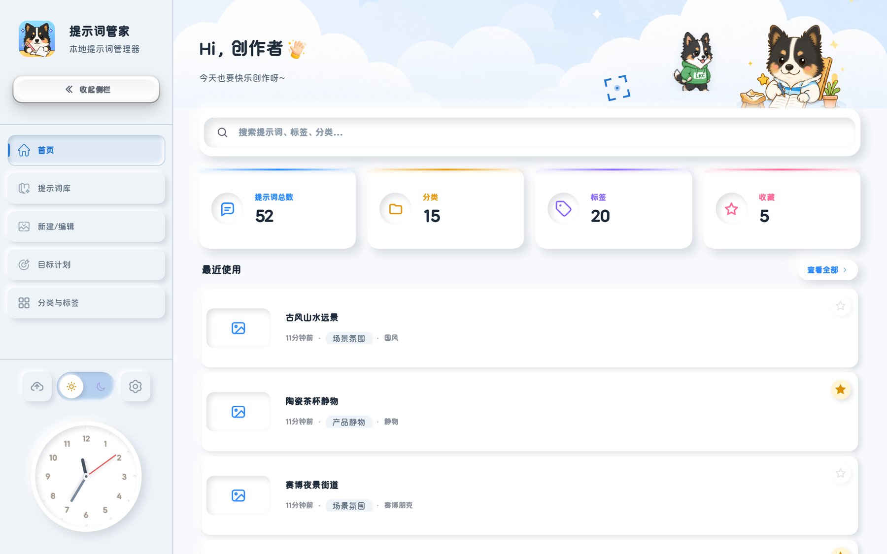
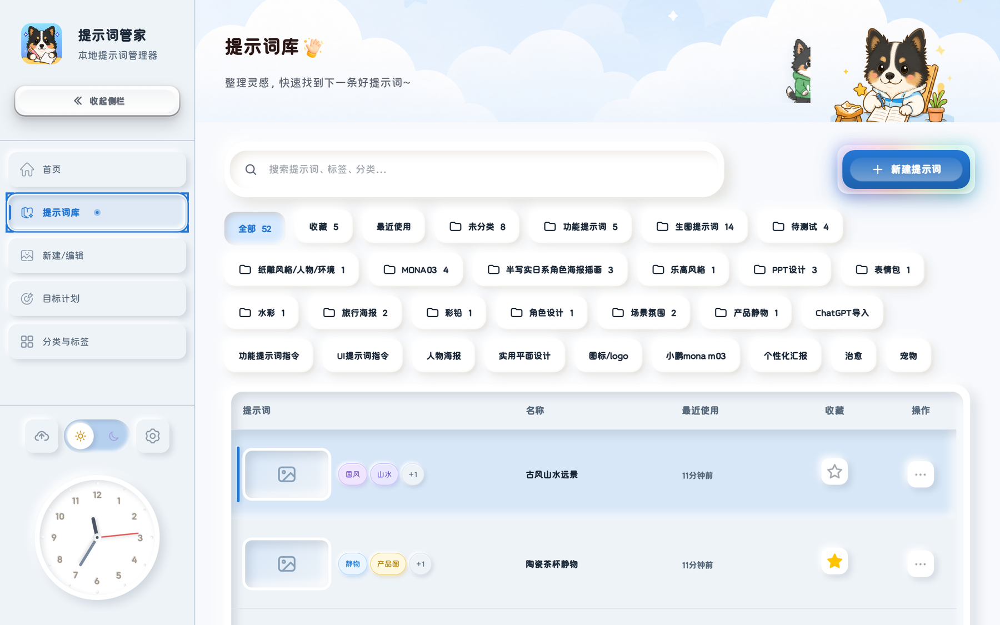
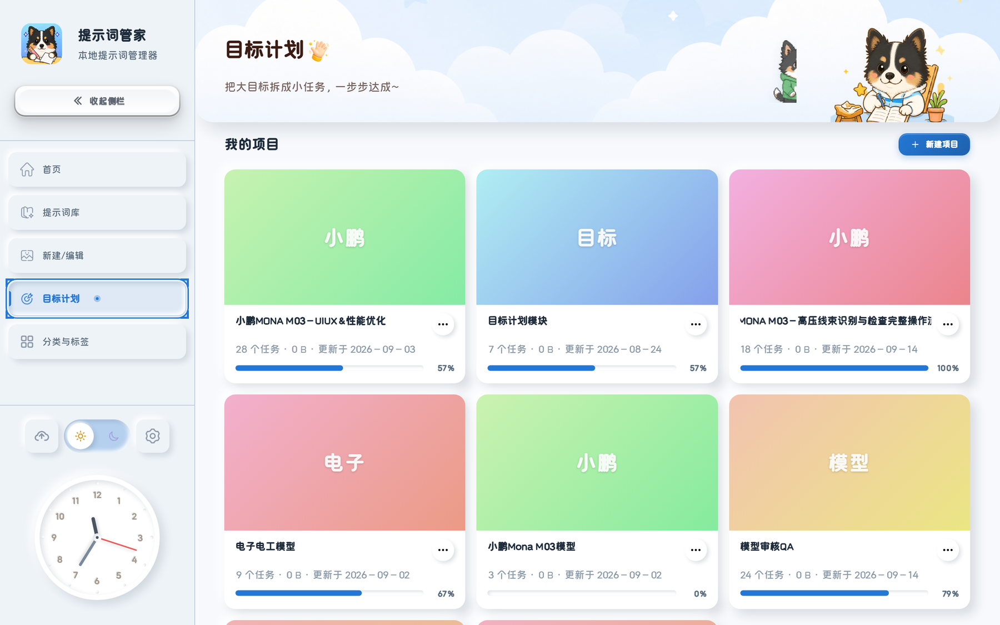

# 提示词管家 PromptImageManager

<p align="center">
  
</p>

<p align="center">
  <strong>本地优先的 AI 提示词管家</strong>
</p>

<p align="center">
  管提示词、参考图、分类标签和版本历史；PC 与 Android 在局域网内同步，数据留在自己手里。
</p>

<p align="center">
  <a href="https://github.com/LKC218/prompt-image-tool/releases">
    
  </a>
  
  
</p>

## 下载

当前最新：[v2.5.8](https://github.com/LKC218/prompt-image-tool/releases/latest)

普通用户直接下载发布版，无需安装 Python 或前端依赖。

- [GitHub Releases](https://github.com/LKC218/prompt-image-tool/releases/latest)
- Windows：`PromptImageManager-Setup-2.5.8.exe`
- Android：`PromptImageManager-v2.5.8-Android.apk`（若该版本未附带 APK，请继续使用 Release 页中可用的最新 Android 包）

> Android 首次安装如被拦截，请在系统设置中允许安装未知来源应用。

## 界面预览

| PC 首页 | 提示词库 |
| --- | --- |
|  |  |

| 目标计划 | 移动端首页 |
| --- | --- |
|  |  |

## 核心功能

| 能力 | 说明 |
| --- | --- |
| 提示词库 | 保存、搜索、编辑和复用正向 / 反向提示词与创作参数 |
| 分类与标签 | 用分类、颜色和标签整理项目、风格、场景和用途 |
| 图片管理 | 为提示词绑定封面图、参考图和本地图片资源 |
| 版本记录 | 保留修改历史；PC 支持详情弹窗与双提示词对比阅读 |
| 目标计划 | 项目 → 任务两级清单，支持父子任务、优先级和任务图片 |
| 数据备份 | 本地导入、导出、备份与迁移 |
| 局域网同步 | PC 与 Android 拉取、回传和双向同步 |
| 跨端发布 | Windows 安装包、Android 安装包、Web 开发运行 |

## 快速开始（开发）

本地开发服务器：

```powershell
npm install
python scripts\start_dev_server.py
```

仅启动前端：

```powershell
npm run dev
```

Windows 一键启动：

- 双击 [`一键启动-服务器和网页.bat`](./一键启动-%E6%9C%8D%E5%8A%A1%E5%99%A8%E5%92%8C%E7%BD%91%E9%A1%B5.bat)

## 局域网同步

- Android 从 PC 拉取数据、回传数据，或双向同步。
- PC 默认端口 `8888`，占用时回退 `8889-8897`。
- 移动端支持 `IP`、`IP:端口`、`http://IP:端口` 三种写法。

## 构建

```powershell
# PC 安装包
python scripts\build_pc_package.py

# Android 安装包
python scripts\build_android_package.py

# 双端发布包
python scripts\build_release_packages.py
```

## 目录说明

| 路径 | 职责 |
| --- | --- |
| `src/` | 前端源码、样式、交互脚本和运行时资源 |
| `python/` | Python 后端、接口和测试 |
| `src-tauri/` | Tauri 桌面端工程 |
| `android/` | Capacitor Android 原生工程 |
| `installer-shell/` | Tauri 自定义安装器壳工程 |
| `scripts/` | 构建、维护、发布脚本与 README 预览截图脚本 |
| `docs/` | 技术文档、设计文档、计划文档和测试记录 |
| `releases/` | 本地发布产物落点，安装包不提交到 Git |

## 文档入口

- [文档中心](docs/README.md)
- [项目文件导航](docs/apps-code-map.md)
- [PC 技术文档](docs/技术文档/pc-technical-doc.md)
- [移动端技术文档](docs/技术文档/mobile-technical-doc.md)
- [局域网同步设计](docs/技术文档/lan-sync-design-doc.md)
- [API 参考](docs/技术文档/api-reference.md)
- [构建方案](docs/构建方案/README.md)
- [版本记录](docs/版本记录/changelog.md)

## 仓库规范

- 源码、配置、文档和必要静态资源进入 Git。
- 安装包、构建缓存、运行时数据、备份文件和本地私有配置不进入 Git。
- `python/data/` 只保留 `.gitkeep`，真实提示词数据、备份和图片由 `.gitignore` 排除。
- 发布安装包使用本地 `releases/` 产物或 GitHub Releases，不直接提交到仓库历史。

## 数据与隐私

项目优先本地存储。局域网同步仅在用户指定网络环境使用，写入类同步接口含配对令牌校验。提交代码前请确认未将个人数据、备份、令牌或本地路径写入仓库。

Windows 默认数据目录：`%APPDATA%\PromptImageManager\data`。可访问 `http://127.0.0.1:8888/api/health`，或查看开发服务器控制台中的「数据目录」。隔离测试数据可设置 `PROMPT_IMAGE_TOOL_DATA_DIR`。
