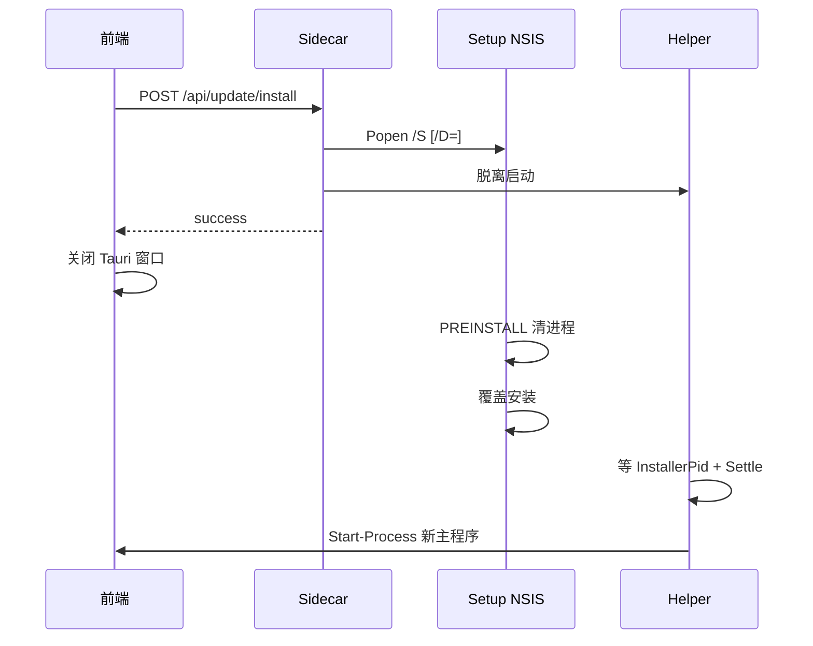

# Tauri主包自动更新安装重启修复实施计划

> 创建日期：2026-09-24  
> 状态：待审核  
> 分类：01-Bug修复与异常排查  
> 目标端：PC **Tauri 主包**（应急 PyInstaller 包仅保留多候选兼容，不作本期验收主路径）  
> 关联：[应用自动更新功能实施计划-260915](../04-新功能实装与增强/应用自动更新功能实施计划-260915.md)、[update-auto-restart](../compose-spec/update-auto-restart.md)、[fix-auto-update-bugs](../../compose/spec/fix-auto-update-bugs.md)

---

## 一、问题与结论

### 1.1 现象

应用内自动更新：**无法正常更新安装并替换老版本**，**无法在退出后自动重启进入新版本**。

### 1.2 根因（架构半迁移）

自动更新链路按 **旧 PyInstaller 全量包** 契约实现，主发布已是 **Tauri 壳 + Sidecar**：

| 契约 | 代码现状 | Tauri 主包实际 |
|------|----------|----------------|
| 主程序名 | 硬编码 `PromptImageManager.exe` | `productName=生图提示词管理器`，主 exe 为中文名（默认 `mainBinaryName` 跟随 productName） |
| 版本 meta | helper 读 `frontend/index.html` | 前端打进 WebView 资源，**无** PyInstaller 的 `frontend/` 布局 |
| 安装根 | `dirname(sys.executable)` | Sidecar 为 `PromptImageManager-Server.exe`，路径≠安装根 |
| `/D=` | 一律传入 | 易写到 server 旁路目录，**替换失败/双份并存** |
| 退出回收 | `taskkill /T /IM PromptImageManager.exe` + sidecar `os._exit` | 名字对不上则杀不掉旧壳；对得上则可能在安装器拉起前自杀 |

历史修复停在交互层（确认框 Promise、进度按钮、`/D=` 引号），未对齐布局契约，故会复发。

### 1.3 本期目标

Tauri 主包闭环：

```text
检查更新 → 下载 → SHA256 → 静默覆盖安装（正确替换旧版）→ 退出当前应用 → 自动启动新版本
```

---

## 二、范围

### 范围内

1. 安装根 / 主 exe / 进程名解析对齐 Tauri 布局（兼容残留应急包命名）。
2. `run_installer` 时序去自杀竞态；`/D=` 条件化。
3. PowerShell helper：目标 exe、软版本校验、稳定拉起。
4. 前端安装成功后关闭 Tauri 窗口，触发 `RunEvent::Exit` 回收 Sidecar。
5. NSIS hook 清进程名单补齐中文主 exe。
6. 更新诊断日志（失败可对照，不再盲猜）。
7. 单测 + 真机手测；同步模块说明与 code map。

### 范围外

- 不引入 `tauri-plugin-updater` / 签名增量更新（留作二期 B 线）。
- 不改 Android、不改下载 Job / 进度弹窗主交互（除非为退出编排所需的一行调用）。
- 不重写发布脚本命名体系（仅做一致性核对与文档记录；若产物命名与 `latest.json.url` 不一致，单列任务）。
- 不做自动回滚、不做 A/B 双目录。

---

## 三、目标行为（时序）

```text
用户确认「下载安装」
  → 前端下载 Job + SHA256（不变）
  → POST /api/update/install { path, expectedVersion }
  → Sidecar run_installer：
       1. 解析 installDir / targetExe（Tauri 优先）
       2. Popen Setup "/S"（仅当 installDir 可信时追加 "/D=<dir>" 且末尾无引号）
       3. 分离启动 helper(InstallerPid, TargetExe, ExpectedVersion)
       4. 返回 JSON（此时不再 taskkill 自己）
  → 前端 ready 文案
  → 前端关闭主窗口（Tauri close/exit）
  → Tauri RunEvent::Exit：杀 Sidecar（既有逻辑）
  → NSIS PREINSTALL：清残留主程序/Server/项目 python（既有 hook + 名单补齐）
  → 安装器完成覆盖替换
  → helper 等待 InstallerPid 结束 + Settle
  → Start-Process TargetExe → 新版本
```



---

## 四、技术设计

### 4.1 进程名与主 exe 候选

常量（`python/auto_update.py` / `build/auto_update.py`）：

```text
MAIN_APP_IMAGE_NAMES =
  - 生图提示词管理器.exe
  - PromptImageManager.exe
  - PromptImageManager-Server.exe   # 仅用于 NSIS 清理，不作 helper 目标

MAIN_APP_EXE_CANDIDATES（按序探测文件存在）=
  - 生图提示词管理器.exe
  - PromptImageManager.exe
```

`resolve_target_exe(install_dir)`：按候选返回第一个存在的绝对路径；都不存在则返回空（helper 不重启）。

### 4.2 安装根解析 `resolve_install_dir()`

优先级（Windows 生产包）：

1. **父进程可执行文件目录**（Tauri 主壳路径最可信）：Sidecar 取 `os.getppid()`，PowerShell/CIM 读 `ExecutablePath`，`dirname` 即安装根。  
2. **Sidecar 路径上溯**：`dirname(sys.executable)` 若自身或父目录存在主 exe 候选，则取该目录；若为 `...\server\` / `...\resources\server\`，上溯 1–2 级再找主 exe。  
3. **注册表**（`winreg`，HKCU）：  
   - `Software\PromptImageManager\InstallDir`（应急 NSIS）  
   - `Software\Microsoft\Windows\CurrentVersion\Uninstall\com.promptimagemanager*` 的 `InstallLocation` / `DisplayIcon` / `UninstallString` 目录  
   - 显示名含「生图提示词管理器」的 Uninstall 项目录  
4. 默认目录候选：`%LOCALAPPDATA%\生图提示词管理器`、`%LOCALAPPDATA%\PromptImageManager`。

返回值必须 **目录内能解析出主 exe** 才算成功；否则视为 `install_dir=""`。

### 4.3 `/D=` 策略

- 仅当 `install_dir` 解析成功 **且** 目录内已有主 exe 时追加 `/D=<install_dir>`。  
- Windows 命令行保持手工拼接：`"<setup>" /S /D=<dir>`，`/D=` 末尾、**无引号**（NSIS 限制）。  
- 解析失败：只跑 `"<setup>" /S"`，交给 Tauri NSIS 自己的 `currentUser` 安装模式（禁止把 server 目录当安装根）。

### 4.4 `run_installer` 去自杀竞态

**删除** 现有开头的 `kill_main_app_for_install()` 对主程序的 `/T` 树杀（或改为：安装器 Popen **成功之后** 再按镜像名单 `taskkill`，且 **绝不** 杀当前 PID 树）。

理由：`taskkill /F /T /IM PromptImageManager.exe` 在 Tauri 下要么无效，要么触发 `RunEvent::Exit` 把正在拉起 Setup 的 Sidecar 一并收掉。清进程责任归 NSIS `PREINSTALL`。

### 4.5 Helper 脚本

| 项 | 现状 | 改为 |
|----|------|------|
| 等待 | `InstallerPid` 轮询 | 保持；超时默认 900s |
| Settle | 2s | **3s**（覆盖杀进程后的句柄释放） |
| 目标 | 写死 `PromptImageManager.exe` | 传入已解析的 `TargetExe`（绝对路径） |
| 版本门闩 | 读不到 meta 仍可启动；读到且不一致则 **拒绝启动** | **软校验**：只写日志。Tauri 无 `frontend/index.html`，硬门闩会稳定误杀「不重启」 |
| 启动 | `Start-Process -FilePath $TargetExe -WorkingDirectory $exeDir` | 保持；`TargetExe` 不存在则放弃并记日志 |

`expectedVersion` 保留传参，仅用于日志与可选 PE 文件时间/版本资源对比（不阻断启动）。

### 4.6 前端退出编排

`src/js/release/auto-updater.js`：`installDownloadedUpdate` 成功且 phase=`ready` 后：

1. Toast / 进度文案（可微调为「安装程序已启动，应用即将退出」）。  
2. **主动关闭窗口**：优先 `@tauri-apps/api` `getCurrentWindow().close()`；失败则 `window.close()`；开发环境不关窗。  
3. 不依赖 Sidecar `os._exit` 去结束 UI（那是壳职责）。

`handle_update_install` 里的 `threading.Timer(0.3, exit_app_after_install)` **保留作兜底**，但不再作为主退出路径。

### 4.7 NSIS 清进程名单

`src-tauri/nsis/installer-hooks.nsh` 与 `build/installer.nsi` 的 `KillPromptImageManagerProcesses` 增加：

```text
taskkill /F /T /IM 生图提示词管理器.exe
```

与既有 `PromptImageManager.exe` / `PromptImageManager-Server.exe` / 项目 python 并列。

### 4.8 诊断日志

路径：`%TEMP%\prompt-image-update.log`（或 `%LOCALAPPDATA%\PromptImageManager\logs\update-install.log`，二选一写死并文档化）。

每次 `run_installer` / helper 记录：

- 时间戳、本地版本、期望版本  
- 解析到的 `installDir` / `targetExe` / 父进程 PID 与路径  
- 完整 Setup 命令行、`installerPid`、`helperSpawned`  
- helper：等待结束时刻、Settle 后路径探测结果、是否 `Start-Process`

失败手测时用户可直接回传该日志。

### 4.9 发布命名一致性核对（清单项，非大改）

现网 `latest.json.url` 必须指向 **真实上传的 Tauri NSIS 包**。核对：

| 来源 | 期望 |
|------|------|
| `npx tauri build` 产物 | `生图提示词管理器_<ver>_x64-setup.exe` 或已重命名的 `PromptImageManager-Setup-<ver>.exe` |
| `scripts/publish_release.ps1` | 发现的文件名与上者一致 |
| `releases/latest.json` 的 `url` | 下载后 SHA256 与 `sha256` 字段一致 |

不一致则只改拷贝/命名/`latest.json` 生成，不改更新协议字段。

---

## 五、改动文件清单

| 文件 | 变更 |
|------|------|
| `python/auto_update.py` | 主 exe 候选、`resolve_install_dir`、`resolve_target_exe`、`run_installer` 时序、`/D=` 条件化、helper 软校验、日志 |
| `build/auto_update.py` | 与上 **字节级同步** |
| `src/js/release/auto-updater.js` | ready 后关闭 Tauri 窗口 |
| `src-tauri/nsis/installer-hooks.nsh` | 清进程名单 + 中文主 exe |
| `build/installer.nsi` | 同名单宏 |
| `python/tests/test_auto_update.py` | 新增 Tauri 解析 / 时序 / `/D=` 分支用例 |
| `src/js/release/auto-updater.test.js` | 关窗调用（可 mock） |
| `docs/模块说明/应用内自动更新模块.md` | 契约与日志说明 |
| `docs/导航/apps-code-map.md` | 入口落点 |
| `docs/计划与规格/计划文档-分类索引.md` | 挂本计划 |
| `docs/质量与复盘/经验沉淀/项目开发经验.md` | 若手测确认「父进程目录优先 + 禁止安装前树杀」为通用经验则追加 |

---

## 六、任务拆解与验收

| ID | 任务 | 验收 |
|----|------|------|
| T1 | 实现主 exe 候选 + `resolve_install_dir`（父进程→上溯→注册表→默认） | 单测覆盖 4 级优先级；Tauri 模拟路径解析出安装根与主 exe |
| T2 | `resolve_target_exe` + `/D=` 条件化 | mock Popen：可信目录带 `/D=` 且末尾无引号；不可信则仅 `/S` |
| T3 | `run_installer` 去掉安装前树杀；保留 helper spawn 字段 | 不再在 Popen 前 `taskkill` 主程序；返回结构兼容旧字段 |
| T4 | Helper 软校验 + Settle 3s + 日志 | 无 `frontend/index.html` 时仍 `Start-Process`；日志含路径与版本 |
| T5 | 前端 ready 后关窗 | vitest：Tauri mock 下调用 close；开发环境不误关 |
| T6 | NSIS hook 名单补中文 exe | 脚本文本断言含 `生图提示词管理器.exe` |
| T7 | 双副本同步 + 单测全绿 | `filecmp` 一致；`pytest python/tests/test_auto_update.py` + `npm test` 相关套件通过 |
| T8 | 真机手测清单 | 见下 |
| T9 | 文档同步 | 模块说明 / code map / 索引；按需经验沉淀 |

### 手测清单（Tauri 主包）

1. 旧版装好并运行 → 应用内更新到新版：**覆盖替换成功**，无双目录残留。  
2. 安装完成后 **自动进入新版本**（版本号已变）。  
3. 自定义安装目录（路径含空格）：仍替换原目录并重启。  
4. 中文安装路径：同上。  
5. 更新时主窗口/Sidecar 均在跑：Setup 不报「无法打开要写入的文件」。  
6. 失败场景：断网下载失败可重试；安装器异常时日志可定位。  
7. 核对 `releases/latest.json.url` 实包 SHA256。

---

## 七、风险与对策

| 风险 | 对策 |
|------|------|
| Tauri NSIS 忽略 `/D=` 或有自己的 InstallLocation | 解析失败不传 `/D=`；手测自定义目录；必要时只信注册表 InstallLocation |
| 父进程在 Sidecar 启动后已退出 | 降级到上溯/注册表；日志标明来源 |
| 关窗后 Tauri `Exit` 杀 Sidecar 过早 | helper 与 Setup 必须在 HTTP 响应前已 Popen；响应后才关窗 |
| 中文镜像名 `taskkill /IM` | 系统 ANSI/Unicode 下测试；备选 `Stop-Process -Name` / CIM |
| 老用户仍为应急 PyInstaller 布局 | 候选名单兼容 `PromptImageManager.exe` + 多 meta 路径，但不阻塞 Tauri 主验收 |

---

## 八、二期备选（本期不做）

1. **B2 mini-updater.exe**：下载/校验/安装/拉起收成独立小进程，去掉 PowerShell helper。  
2. **B1 `tauri-plugin-updater`**：签名 + `quitAndInstall`，发布链改签名资产。  
3. A/B 双目录热切换。

---

## 九、实施顺序建议

```text
T1 → T2 → T3 → T4 → T5 → T6 → T7 → T8 → T9
（T5 可与 T4 并行；T8 依赖 T1–T6 全部完成）
```

预计改动集中在 `auto_update.py` 双副本与安装/退出编排，**不**动业务功能面。
