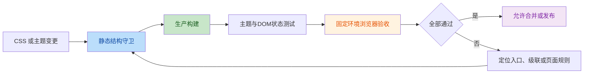

# 全局CSS验收测试计划

> 创建日期：2026-07-16  
> 状态：待实施  
> 计划分类：测试验证  
> 验收范围：主题 Token、启动屏、PC 样式入口与子文件、移动端样式、响应式、动效、焦点和动态弹层  
> 关联代码：`src/css/`、`src/js/main.js`、`src/js/theme-service.js`、`src/js/pc-css-test-utils.js`

---

## 一、目标与原则

建立跨端全局 CSS 验收基线，确保样式入口、主题状态、级联顺序、响应式、可访问性和动态弹层在改动后可验证。

本计划分为两层：

1. 自动化结构守卫：验证入口、导入顺序、主题 Token、低动效和构建结果。
2. 可复现浏览器验收：以固定端类型、视口、主题和数据集检查实际布局、层级和交互状态。

不将“选择器存在”视为视觉正确性的充分证据；不在本计划内引入浏览器自动化依赖或进行像素级设计稿比对。



## 二、验收范围与边界

### 2.1 纳入范围

- `theme-tokens.css` 的浅色、深色、工作台主题和固定状态色。
- `index.html` 启动屏内联样式及首屏主题切换。
- PC 端 `pc.css` 聚合入口、`01` 至 `06` 样式文件及固定级联顺序。
- 移动端 `mobile.css` 的页面、底部导航、触控入口和弹层样式。
- `prefers-reduced-motion`、`focus-visible`、媒体查询与容器查询。
- Toast、Modal、更新记录、右键菜单、图片预览等动态挂载组件。

### 2.2 不纳入范围

- 业务数据、同步、导入导出正确性。
- Android 原生 WebView、Tauri 原生窗口和安装器壳原生控件外观。
- 像素级设计稿复刻与自动截图差异比对。
- CSS 架构重构、选择器去重或视觉方案调整。

## 三、验收环境

| 项目 | 基线要求 |
|---|---|
| 运行环境 | 已安装项目 Node 依赖，使用本地开发服务或完整开发服务 |
| PC 视口 | `1440×900`、`1280×800`、`1024×768` |
| 移动视口 | `390×844`、`360×800`、`768×1024` |
| 外观与主题 | 浅色/深色 × sky、caramel、forest、night、mint |
| 动效偏好 | 默认与系统“减少动态效果”各验证一次 |
| 验收数据 | 至少一条含图片的提示词、一个分类、一个标签、可触发下载记录和更新记录入口 |
| 端类型 | 使用 `/?ui=pc` 与 `/?ui=mobile` 固定目标端，避免自动检测造成端类型漂移 |

验收前清理浏览器控制台错误、刷新缓存，并确认主题状态从持久化设置重新恢复。

## 四、自动化验收矩阵

| 编号 | 对象 | 执行方式 | 通过标准 |
|---|---|---|---|
| CSS-01 | PC 入口与测试读取顺序 | 新增或扩展 Vitest 文本断言 | `pc.css` 的导入清单与 `pc-css-test-utils.js` 完全一致，`06-responsive-overrides.css` 始终末位 |
| CSS-02 | 端侧加载边界 | Vitest 文本断言 | `main.js` 仅加载 Token；PC/移动端入口只加载各自样式入口；业务模块不直接导入 PC 子文件 |
| CSS-03 | Token 完整性 | Vitest 文本断言 | 浅色、深色和五种工作台主题均包含品牌主色、悬浮、弱化、强调和焦点 Token；固定状态色不被主题覆盖 |
| CSS-04 | 焦点与低动效 | 扩展 CSS 文本断言 | PC/移动端保留 `focus-visible` 与 `prefers-reduced-motion`；移动端保留触控和精细指针差异规则 |
| CSS-05 | 主题状态链 | Vitest + jsdom | 主题设置后根节点属性与持久化值一致，切换外观和工作台主题不串扰 |
| CSS-06 | 生产产物 | `npm run build` | 退出码为 0；无 CSS 语法、导入路径或新资源解析错误；`dist` 存在可加载入口 |
| CSS-07 | 全量回归 | `npm test` | 全部测试通过；新增 CSS 守卫不弱化既有断言 |

自动化最低门槛为：`npm test` 与 `npm run build` 均通过。

## 五、浏览器人工验收矩阵

| 编号 | 验收对象 | 操作与页面 | 通过标准 |
|---|---|---|---|
| UI-01 | 启动屏和首屏 | 浅色、系统深色下访问根路径 | 无白闪、未样式化内容或不可读文字；应用挂载后启动屏正确移除 |
| UI-02 | PC 应用壳 | 首页、提示词库、详情、编辑器、分类、设置 | 侧栏、欢迎区、主内容、卡片和滚动区域无重叠、截断或横向溢出 |
| UI-03 | 移动应用壳 | 首页、提示词库、详情、编辑、分类、设置 | 底部导航不遮挡操作区；长内容、输入框和弹层无横向滚动或被遮挡 |
| UI-04 | 主题矩阵 | 双端逐页抽检五主题和浅深模式 | 背景、文字、边框、图标、品牌控件和状态反馈均可读；主题不覆盖固定状态色和内容索引色 |
| UI-05 | 响应式与容器查询 | PC 展开/收起侧栏，按三种 PC 视口检查关键页面 | 表格、筛选、分页、欢迎横幅和编辑器不溢出，断点切换无错位 |
| UI-06 | 动态弹层 | Toast、Modal、更新记录、右键菜单、图片预览 | 遮罩、层级、关闭、焦点进入与归还正常；不被导航、欢迎区或其他弹层遮挡 |
| UI-07 | 键盘可访问性 | Tab、Shift+Tab、Enter、Escape | 可见焦点明确；弹窗可关闭且焦点归还触发入口 |
| UI-08 | 减少动态效果 | 系统启用减少动态效果后重载关键页面 | 动画停止或降级，状态与可操作性不受影响 |

## 六、执行流程

1. 准备第三节的视口、主题和最小数据集。
2. 执行 `npm test`，处理所有失败项后再进入构建。
3. 执行 `npm run build`，确认无新增 CSS 解析、导入路径或资源问题。
4. 启动 `npm run dev:full`；仅验证静态视觉壳时允许使用 `npm run dev`。
5. 按 `UI-01 → UI-08` 顺序执行人工验收；记录端类型、视口、主题、页面、复现步骤和截图。
6. 将发现的问题按“入口/Token/基础组件/页面/后置覆盖/动态弹层”归类，避免直接在末尾补丁区无序修复。
7. 修复后重新执行关联自动化项与受影响人工矩阵；入口、Token、最终覆盖层或弹层改动必须执行全量矩阵。

## 七、变更触发规则

| 变更类型 | 最低执行范围 |
|---|---|
| 单个页面局部样式 | CSS-04、CSS-06、CSS-07 + 关联页面、主题、视口和动效人工项 |
| PC 样式入口或子文件顺序 | CSS-01、CSS-02、CSS-06、CSS-07 + 全部 PC 页面和动态弹层 |
| 移动端全局样式 | CSS-04、CSS-06、CSS-07 + 全部移动页面和底部导航 |
| 主题 Token 或主题服务 | CSS-03、CSS-05、CSS-06、CSS-07 + 双端主题矩阵、启动屏 |
| 响应式、容器查询、动效 | CSS-04、CSS-06、CSS-07 + 相关端类型的多视口和减少动态效果 |
| Toast、Modal、菜单、预览 | CSS-04、CSS-06、CSS-07 + UI-06、UI-07、浅色/深色和窄窗口 |

## 八、验收记录模板

每次全局 CSS 验收创建一份测试记录，至少包含：

```text
验收日期：
变更范围：
提交或分支：
执行人：
自动化结果：npm test / npm run build
浏览器与版本：
端类型与视口：
外观与工作台主题：
测试数据准备：
通过项：
失败项与复现步骤：
截图或录屏位置：
修复后复测结果：
```

记录文件仅保存测试结论、截图路径和可复现步骤；不保存用户隐私数据、访问令牌或真实业务导出文件。

## 九、实施阶段

### 阶段 1：建立自动化结构守卫

| 编号 | 任务 | 文件或模块 | 验收标准 |
|---|---|---|---|
| 1.1 | 建立 PC 入口与测试读取顺序断言 | `pc.css`、`pc-css-test-utils.js`、新增测试 | 顺序、数量和最终覆盖层一致 |
| 1.2 | 建立端侧样式加载边界断言 | `main.js`、`pc-app.js`、`mobile-app.js` | 无业务模块绕过稳定 CSS 入口 |
| 1.3 | 补齐 Token、焦点与低动效断言 | `theme-tokens.css`、PC/移动端 CSS 测试 | 主题和可访问性底线可自动检测 |
| 1.4 | 保持主题服务 DOM 状态测试 | `theme-service.test.js` | 根节点属性与持久化一致 |

### 阶段 2：固化人工验收基线

| 编号 | 任务 | 产出 | 验收标准 |
|---|---|---|---|
| 2.1 | 准备最小验收数据集 | 数据准备说明 | 列表、详情、标签、图片预览和记录入口可见 |
| 2.2 | 执行 PC/移动端页面矩阵 | 首次验收记录 | 六页、主题、视口、焦点和低动效覆盖完成 |
| 2.3 | 执行动态弹层矩阵 | 弹层验收记录 | 层级、遮罩、关闭与焦点归还通过 |
| 2.4 | 归档问题和截图 | 测试记录 | 每项问题可复现、可定位、可复测 |

### 阶段 3：后续自动化演进

当人工矩阵稳定且需要 CI 阻断视觉回归时，单独立项接入浏览器自动化与截图比对。

- 固定浏览器版本、视口、字体和验收数据。
- 建立页面种子数据和网络依赖替身，确保截图稳定。
- 先覆盖启动屏、应用壳、主题切换、动态弹层和关键断点，再扩展到完整页面矩阵。
- 截图基线、阈值与更新审批不得与本计划的结构守卫改动混为同一批次。

## 十、风险与控制

| 风险 | 影响 | 控制措施 |
|---|---|---|
| 文本测试假通过 | 选择器存在但布局或优先级错误 | 浏览器人工矩阵覆盖计算布局、层级和主题组合 |
| 手工验收遗漏 | 主题、视口和端类型组合过多 | 固定矩阵、视口与记录模板，按变更触发规则执行 |
| 验收数据不足 | 空态掩盖列表、菜单、预览和详情问题 | 使用最小数据集并记录准备条件 |
| CSS 顺序漂移 | 入口与测试读取不一致 | CSS-01 同时验证入口和测试清单 |
| 主题污染状态色 | 工作台主题覆盖成功、警告、危险语义 | CSS-03 + UI-04 同时验证 Token 与页面表现 |
| 引入自动化成本失控 | 浏览器依赖、截图噪声和 CI 时间上升 | 先运行两层验收基线，浏览器自动化另立计划 |

## 十一、文档同步

- 本计划实施后更新 `docs/apps-code-map.md` 的主题与外观模块导航。
- 更新 `docs/模块说明/PC端样式模块.md`，补充 PC 样式验收入口及顺序一致性要求。
- 新建或更新 `docs/模块说明/全局样式与主题模块.md`，说明跨端入口、Token、启动屏例外和验收分层。
- 形成可复用的验收记录后，视价值补充 `docs/项目开发经验/项目开发经验.md`。

## 十二、项目级约束校验单

- [ ] 是否已同步 `docs/apps-code-map.md` 及就近模块说明文档？原因：本文件为待实施计划，实施阶段完成后同步最终验收入口。
- [ ] 本次改动是否产生了新的跨模块耦合？否。本计划只定义验收约束和执行方式。
- [ ] 本次解决的难题是否需要沉淀至 `docs/项目开发经验/项目开发经验.md`？原因：待完成首次全局验收并形成稳定记录后评估。
