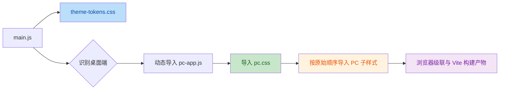

# PC端样式文件拆分治理计划

> 创建日期：2026-07-16  
> 状态：已实施  
> 计划分类：项目治理  
> 关联代码：`src/css/pc.css`、`src/js/pc-app.js`、`src/js/pc-utils.js`  
> 关联规范：`docs/设计文档/跨端配色与主题令牌规范.md`

---

## 一、背景与问题

`src/css/pc.css` 已超过一万行，桌面端页面壳、通用组件、业务页面、弹层、主题覆盖、响应式规则和历史兼容补丁均集中在同一个文件中。

当前文件规模带来以下维护问题：

- 定位单个组件样式需要跨越大量无关规则，修改成本高。
- 设置页存在早期兼容规则和后续完整规则，同名选择器依赖后置定义覆盖前置定义。
- 弹窗、Toast、右键菜单和图片预览器由运行时动态挂载，不属于单一页面，但样式边界不清晰。
- 深色模式、响应式、容器查询、低动效和末尾微交互规则具有全局覆盖性质，若移动位置会改变实际表现。
- 现有部分测试直接读取 `pc.css` 的文本内容；入口改为 CSS 导入后，浏览器构建可正常工作，但测试读取策略需要同步升级。

本次工作是文件组织治理，不调整产品视觉、交互行为、颜色令牌、业务逻辑或路由加载方式。

## 二、目标与边界

### 2.1 目标

- 将桌面端样式拆分为职责可识别、顺序稳定的子文件。
- 保留 `src/css/pc.css` 作为唯一稳定入口，避免影响既有 JavaScript、HTML 演示页和构建流程。
- 严格保持现有 CSS 规则、选择器和级联顺序，确保拆分前后页面表现一致。
- 将依赖单文件文本读取的测试调整为读取完整样式集合，保持原有断言能力。
- 为后续选择器去重、页面样式语义化和组件边界治理建立安全基础。

### 2.2 不在本次范围内

- 不合并或删除重复选择器。
- 不调整颜色、间距、字体、圆角、阴影、断点或动画参数。
- 不重命名 CSS 类、变量、动画名称或 JavaScript 状态类。
- 不改为页面级动态 CSS 导入，避免切换页面时出现未样式化闪烁。
- 不迁移主题令牌体系；主题相关变更继续遵循 `跨端配色与主题令牌规范`。

## 三、现有加载链与设计决策

### 3.1 加载链



`theme-tokens.css` 先提供全局主题语义 Token；`pc-app.js` 再加载 `pc.css`。因此 `pc.css` 必须继续作为桌面端样式总入口，并仅负责按固定顺序聚合子文件。

### 3.2 拆分策略

采用“原始连续区段拆分 + 聚合入口”的两层方案。

- 原始连续区段拆分：规则从原文件剪切到目标文件时保持原有先后顺序，不因业务归类而前移或后移。
- 聚合入口：`pc.css` 仅保留固定顺序的 `@import`，对外路径和引用方式不变。
- 两阶段治理：首轮只进行无行为拆分；选择器去重、补丁收敛和语义重组在后续独立计划中执行。

## 四、目标目录与职责

```text
src/css/
├─ pc.css
└─ pc/
   ├─ 01-foundation-shell.css
   ├─ 02-settings-compat.css
   ├─ 03-shared-components.css
   ├─ 04-settings-page.css
   ├─ 05-pages-overlays.css
   └─ 06-responsive-overrides.css
```

| 顺序 | 文件 | 职责 | 关键约束 |
|---:|---|---|---|
| 01 | `01-foundation-shell.css` | 字体、桌面应用变量、主题属性、光标、应用壳、侧边栏和导航 | `.pc-app` 变量、侧边栏基础规则及导航动画按原始顺序保留 |
| 02 | `02-settings-compat.css` | 设置页早期定义和历史兼容规则 | 禁止与正式设置页规则合并，必须保留其被后续规则覆盖的关系 |
| 03 | `03-shared-components.css` | 侧边栏收起状态、通用布局、按钮、表单、搜索、卡片和跨页面基础组件 | 收起状态位于设置页兼容区段之后，必须按原始连续区段保留 |
| 04 | `04-settings-page.css` | 设置页完整实现、主题选择和页面专属布局 | 必须位于设置页兼容规则之后 |
| 05 | `05-pages-overlays.css` | 首页、提示词库、编辑器、分类、欢迎横幅及所有全局弹层 | 动态挂载组件的样式保持全量加载，不按路由拆分 |
| 06 | `06-responsive-overrides.css` | 末尾全局交互、低动效、主题与布局补丁、媒体查询和容器查询 | 必须始终最后加载，禁止前移或拆散 |

实际连续行段为：`01` 第 1–1184 行、`02` 第 1185–1350 行、`03` 第 1351–2323 行、`04` 第 2324–3217 行、`05` 第 3218–10877 行、`06` 第 10878–12055 行。该边界以不移动任一规则为前提。

## 五、入口文件设计

拆分后的 `src/css/pc.css` 保留以下有序入口内容：

```css
@import "./pc/01-foundation-shell.css";
@import "./pc/02-settings-compat.css";
@import "./pc/03-shared-components.css";
@import "./pc/04-settings-page.css";
@import "./pc/05-pages-overlays.css";
@import "./pc/06-responsive-overrides.css";
```

数字前缀是级联顺序契约，不得按文件名字母顺序、页面访问顺序或目录展示顺序重新排列。

## 六、实施阶段

### 阶段 0：建立可回归基线

| 编号 | 任务 | 产出 | 验收标准 |
|---|---|---|---|
| 0.1 | 记录原始文件行数和拆分前构建状态 | 基线记录 | 可确认拆分未丢失规则 |
| 0.2 | 检索所有直接读取 `pc.css` 文本的测试 | 测试影响清单 | 所有受影响测试均有迁移方案 |
| 0.3 | 确认桌面端关键验证页面和交互 | 回归清单 | 覆盖首页、设置、提示词、编辑、分类和全局弹层 |

### 阶段 1：无行为样式迁移

| 编号 | 任务 | 涉及位置 | 验收标准 |
|---|---|---|---|
| 1.1 | 新建 `src/css/pc/` 目录和六个子文件 | `src/css/pc/` | 文件名称与顺序契约一致 |
| 1.2 | 按原始连续区段迁移基础壳与侧边栏规则 | `01-foundation-shell.css` | 状态类、关键帧、低动效规则未被拆散 |
| 1.3 | 保留设置页兼容区段并迁移通用组件 | `02-settings-compat.css`、`03-shared-components.css` | 重复规则的先后覆盖关系不变 |
| 1.4 | 迁移正式设置页、业务页面和弹层规则 | `04-settings-page.css`、`05-pages-overlays.css` | 页面和动态挂载组件样式完整 |
| 1.5 | 迁移末尾全局覆盖层 | `06-responsive-overrides.css` | 深色、响应式和容器规则仍为最后覆盖层 |
| 1.6 | 将原入口替换为有序导入 | `src/css/pc.css` | 对外入口路径保持不变 |

### 阶段 2：测试适配

| 编号 | 任务 | 涉及位置 | 验收标准 |
|---|---|---|---|
| 2.1 | 建立按入口顺序读取全部 PC 样式文件的测试辅助逻辑 | 现有 CSS 文本断言测试 | 测试读取完整样式集合，而非仅入口文件 |
| 2.2 | 保留现有选择器、状态类和动画存在性断言 | 全部受影响测试 | 断言语义不弱化 |
| 2.3 | 执行相关单元测试 | 测试脚本 | 拆分前后测试结果一致 |

### 阶段 3：构建与视觉回归

| 编号 | 验证项 | 验收标准 |
|---|---|---|
| 3.1 | 生产构建 | 无 CSS 导入路径、语法或构建错误 |
| 3.2 | 桌面端页面 | 首页、设置、提示词库、编辑器、分类页视觉一致 |
| 3.3 | 全局交互 | Toast、Modal、右键菜单、更新记录、图片预览可正常展示 |
| 3.4 | 状态和主题 | 侧栏收起、导航激活、浅色/深色模式正常 |
| 3.5 | 自适应与可访问性 | 窄窗口、容器查询和减少动态效果规则正常生效 |

### 阶段 4：文档同步

| 编号 | 任务 | 验收标准 |
|---|---|---|
| 4.1 | 更新代码地图中的桌面端样式导航 | `docs/apps-code-map.md` 指向稳定入口和样式目录 |
| 4.2 | 新建或更新样式模块说明 | 说明加载链、文件职责和顺序约束 |
| 4.3 | 复核主题规范边界 | 不将 Token 定义迁入页面样式文件 |

## 七、风险控制

| 风险 | 原因 | 控制措施 |
|---|---|---|
| 级联结果变化 | 同名选择器、历史补丁和后置覆盖较多 | 仅按连续原始区段迁移，入口导入严格保持顺序 |
| 测试误报或失效 | 测试直接读取单文件内容 | 测试辅助逻辑按入口顺序合并子文件内容 |
| 动态组件无样式 | 弹层由工具模块临时挂载 | 弹层规则保留在全局加载的页面与覆盖层中 |
| 动画降级失效 | 动画、状态类和低动效规则被分离 | 迁移时以动画能力为最小原子单元核对 |
| 深色或响应式回归 | 末尾覆盖规则优先级被改变 | 全部保留在 `06-responsive-overrides.css` 且最后导入 |

## 八、验收清单

- [x] `pc.css` 仍是桌面端唯一稳定样式入口。
- [x] 六个子文件按数字前缀顺序导入，未发生重新排序。
- [x] 拆分过程未修改选择器、属性值、变量名、动画名和状态类。
- [x] 所有直接读取 `pc.css` 的测试已完成读取逻辑迁移。
- [x] 生产构建成功。
- [ ] 桌面端核心页面、全局弹层、主题和响应式视觉回归通过。原因：当前未启动浏览器进行人工视觉验证。
- [x] `docs/apps-code-map.md` 与样式模块说明已同步最终结构。

## 九、后续治理建议

首轮拆分稳定后，再以独立工作项推进以下内容：

1. 盘点重复选择器和历史兼容补丁，明确可删除边界。
2. 按页面与组件使用范围建立样式所有权，减少跨页面覆盖。
3. 收敛硬编码颜色、阴影和尺寸到既有主题 Token 体系。
4. 为大型样式目录建立模块说明，明确入口、依赖、加载顺序和禁止跨越的边界。

## 十、项目级约束校验单

- [x] 是否已同步 `docs/apps-code-map.md` 及就近模块说明文档？
- [ ] 本次改动是否产生了新的跨模块耦合？否。本计划要求维持现有入口与加载链，不新增跨模块耦合。
- [ ] 本次解决的难题是否需要沉淀至 `docs/项目开发经验/项目开发经验.md`？原因：待实施中确认 CSS 级联与测试迁移的通用实践后再决定沉淀。
