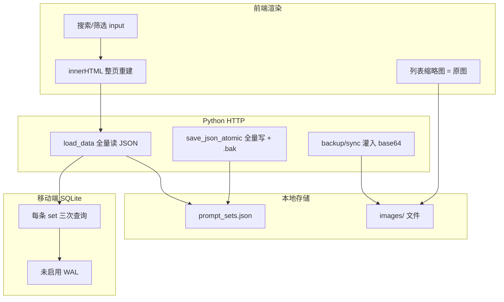

# 软件性能问题诊断报告

> 版本：1.0 | 日期：2026-09-20 | 状态：诊断完成，待评审实施
>
> 范围：PC（Tauri + Python）、移动端（Capacitor + SQLite）、Web 开发运行态。
> 方法：静态代码走读 + 本机数据规模测量 + 文档已知问题交叉验证。未跑 profiling 工具。
> 数据快照（本机 `%APPDATA%\PromptImageManager\data`）：`prompt_sets.json` ≈ 193KB；`images/` 145 个文件 ≈ 39.4MB；单图最大约 670KB。

---

## 一、结论摘要

当前性能风险**不是**「样例数据已经很大」，而是**多条主链路都按「全量 JSON / 全量 DOM / 全量原图 / 全量 base64」设计**。数据量一旦从几十条涨到几百、上千条，会同时打穿：

| 维度 | 用户感知 | 结构性原因 |
|------|----------|------------|
| 输入交互 | 搜索/筛选打字发闷、列表闪烁 | 无 debounce + `innerHTML` 整页重建 |
| 启动与切页 | 首次打开 splash 偏长；进游戏/编辑也慢 | `pc-app.js` 静态引入全部页面 + 整包 CSS |
| 保存与同步 | 收藏/编辑/备份时卡顿、磁盘与内存尖峰 | 每请求全量读 JSON；写路径全量 dump + `.bak`；备份/同步把图片 base64 灌回 JSON |
| 移动端列表 | 条目越多越卡 | 无分页全量渲染 + SQLite N+1 + 无 WAL |
| 图片与内存 | 列表打开时解码原图、滚动掉帧 | 列表缩略图直接请求 `/images/原图` + `Cache-Control: no-cache` |

**已经做对的部分（不要推倒）：**

- 运行时业务 JSON 与图片文件基本分离；列表 API 返回 `firstImage` 引用而非 dataURL（`python/main.py:1858-1880`）。
- 编辑器统一 `optimizeImageDataUrl`，WebP 输出（PC：quality 0.9 / maxSide 2560）。
- 目标计划已有视口内 320px 缩略图方案（提示词库主链路尚未对齐）。
- PC 列表分页默认 20 条/页（`pc-library.js:17`）。
- 植物心跳 API 保存 500ms debounce（`plant-tracker.js:125-131`）。
- 自定义光标已改 GSAP `quickTo`（changelog v2.5.2）。
- 磁盘写入使用临时文件 + `os.replace` 原子替换（`main.py:190-202`）。
- HTTP 服务为 `ThreadingTCPServer`，但**业务数据层无锁**（见问题 D2）。

---

## 二、瓶颈链路示意

---

## 三、问题清单（按链路）

### A. 列表 / 搜索交互

| ID | 问题 | 位置 | 影响 | 根因 | 优化方向 |
|----|------|------|------|------|----------|
| A1 | 搜索无 debounce，每次按键全量重渲染 | `src/js/pc/pc-library.js:541-545`、`pc-home.js:341-347`、`pc-category.js`、`mobile-library.js` | 打字卡顿、表格闪烁 | `input` 直接调 `render*`；全仓库 **0 处 debounce** | 150–200ms debounce；仅更新 tbody/列表节点 |
| A2 | 库页每次渲染重建整个工作区 DOM | `src/js/pc/pc-library.js:272-301` | 选中态、滚动位置、预览区反复丢失/重绘 | `container.innerHTML = table + preview` 一体重建 | 表格区与预览区分轨更新；差分行 |
| A3 | 过滤/排序对全量数组线性扫描，且每次重建 marquee | `pc-library.js:233-243`、`304-321` | 数据量大后每次筛选变慢 | 无索引；marquee 对每行读 `scrollWidth` | 预建搜索索引；marquee 仅 overflow 行、结果变化后再算 |
| A4 | 移动端库无分页，全量渲染 + 逐项动画延迟 | `src/js/mobile/mobile-library.js:124-155` | 几百条时首屏 DOM 爆炸、滚动掉帧 | `list.map` 一次渲染全部；`animation-delay: idx * 30ms` | 分页/滚动加载；长列表关闭 stagger |
| A5 | 首页与库页各自拉取，无共享缓存 | `pc-home.js:175-183`、`pc-library.js:158-162` | 切页重复请求、重复解析 | 模块级 `homeData`/`libraryData` 独立 | 前端列表 store + 失效标记 |

### B. 启动 / 切页 / 包体

| ID | 问题 | 位置 | 影响 | 根因 | 优化方向 |
|----|------|------|------|------|----------|
| B1 | PC 壳静态 import 全部页面模块 | `src/js/pc/pc-app.js:15-25` | 启动解析/执行成本与功能无关（含 tetris/plane/goals） | 路由页未代码分割 | 路由级 `import()`；游戏/编辑器/设置懒加载 |
| B2 | CSS 全量 `@import`，late-override 体积失控 | `src/css/pc.css:1-15`；`05e-page-late-overrides.css` **≈132KB**；`mobile.css` **≈124KB** | 启动样式解析重；选择器层叠增加重绘成本 | 历史覆盖层未收敛（文档已提示「待收敛」） | 按页拆 CSS 或至少合并 late-override；去掉重复选择器 |
| B3 | 植物素材经首页静态链路打入包 | `plant-view.js` + `src/assets/pc/plant/` | 不进首页逻辑也要付素材解析成本 | 与 B1 叠加 | 植物模块随首页动态加载 |
| B4 | 依赖体积：gsap / motion / react / sortablejs 一并进包 | `package.json:26-42` | 网页端与安装包体积 | 未做依赖侧载或按需 | 游戏与动效按需加载；评估 motion 是否仍必需 |
| B5 | Android 未使用的 Capacitor 插件仍打包 | 交接文档 WEB-005 | APK 体积 | `@capacitor/camera`、`network` 已装未用 | 清理或延迟注册 |

### C. 数据层：保存 / 备份 / 同步

| ID | 问题 | 位置 | 影响 | 根因 | 优化方向 |
|----|------|------|------|------|----------|
| C1 | 每个 API 请求全量读 `prompt_sets.json` | `main.py:205-206`、`1858+` | 数据变大后列表/详情/收藏皆变慢 | 无进程内缓存与 mtime 失效 | 内存缓存 + 文件 mtime/版本号 |
| C2 | 每次写全量 `json.dump(indent=2)` + 复制 `.bak` | `main.py:190-202` | 保存延迟与磁盘 I/O 翻倍；`.bak` 无限膨胀 | 备份策略与业务写路径绑死 | 生产写可省 indent；`.bak` 节流/轮转（如每日一份） |
| C3 | Threading 服务无业务数据锁 | `main.py:2540-2541`；交接文档 PC-001 | 并发请求丢写、读到中间态 | 多线程 handler + 无锁 load-modify-save | 数据文件 `RLock` + 写版本号 |
| C4 | 备份/导出把全部图片 base64 写回 JSON | `main.py:530-545` `build_backup_payload` | 导出瞬间内存尖峰；备份文件巨大 | 协议设计为「一包 JSON 含图」 | ZIP 路径保持元数据+图片分文件；避免双重全量 |
| C5 | 局域网同步 push/preview 走整包 export | `lan-sync.js:749+`；`api-storage.js:174-176` | 同步时 PC/手机内存与网络双压 | `exportData()` 含 base64 | 同步只传元数据 + 图片清单；图片分片拉取 |
| C6 | 双向同步响应再次返回全量 PC payload | `main.py:2480-2501` | 一次回传 = 双倍传输与解析 | merge 后立即 `build_sync_payload()` | 响应只返回摘要/冲突项 |
| C7 | `estimateStorageSize` 先整包 export | `api-storage.js:174-176` | 打开设置相关功能短暂卡顿 | 用序列化体积代替磁盘统计 | 后端返回目录文件 size 总和 |
| C8 | 图片上传走 JSON body base64 | `api-storage.js:121-123`；`main.py:316-337` | 多图保存请求体巨大、按钮 loading 久 | 非流式/非 multipart | multipart 或二进制流；并发限制与进度 |
| C9 | 图片接口 `Cache-Control: no-cache` 且无 ETag | `main.py:2503-2525`、`2322-2342` | 列表/详情反复重新下载原图 | 缓存策略过严且无校验器 | `private, max-age=...` + mtime ETag；列表用缩略图 URL |
| C10 | 编辑器导入压缩在主线程 Canvas | `image-utils.js`；`pc-editor.js:50-55` | 大图导入时 UI 短暂冻结 | `createImageBitmap`/OffscreenCanvas 未用 | Worker + OffscreenCanvas；限制并发 |

### D. 移动端 SQLite

| ID | 问题 | 位置 | 影响 | 根因 | 优化方向 |
|----|------|------|------|------|----------|
| D1 | `getPromptSets` 对每条 set 额外 2–3 次查询 | `src/js/core/sqlite-storage.js:232-253` | 列表加载随条目线性变慢（N+1） | 循环内 COUNT + first image | 一条聚合 SQL / JOIN 一次出摘要 |
| D2 | 未启用 WAL | `sqlite-storage.js:4-13`；交接文档 AND-005 | 并发写性能受限 | 仅 `foreign_keys=ON` | 启动 `PRAGMA journal_mode=WAL` |
| D3 | 移动端库无分页（与 A4 同源） | `mobile-library.js` | 与 N+1 叠加放大首屏耗时 | UI 与存储双重全量 | 分页查询 + 懒加载 UI |

### E. 动画与装饰（相对次要）

| ID | 问题 | 位置 | 影响 | 根因 | 优化方向 |
|----|------|------|------|------|----------|
| E1 | 光标 `mousemove` 内 `getComputedStyle` + `closest` | `pc-cursor.js:25,53,109-142` | 复杂页持续 CPU | 每次移动同步样式判定 | rAF 合并判定；缓存命中结果 |
| E2 | 卡片视差 hover 时读 `getBoundingClientRect` | `pc-card-parallax.js:27-58` | 目标计划卡片多时划过开销 | 每次 apply 都读 layout | hover 进入时缓存 rect |
| E3 | 新拟态/blur/复杂渐变与光标柔光 | 多处 CSS + `pc-cursor.js` | 合成层压力 | 视觉规范成本 | 已部分约束 blur 时机；保持 hover-only |

---

## 四、按用户痛点映射

| 你关心的痛点 | 直接相关问题 | 建议第一批改动 |
|--------------|--------------|----------------|
| 列表/搜索卡顿 | A1 A2 A3 A5 | debounce + 局部刷新 + 列表缓存 |
| 启动/切页偏慢 | B1 B2 B3 | 路由懒加载 + CSS 收敛 |
| 数据变大后保存/同步慢 | C1 C2 C3 C4 C5 C6 C7 | 进程内缓存 + 写锁 + 同步去 base64 + 体积接口 |
| 移动端列表/同步慢 | A4 D1 D2 D3 C5 | 聚合 SQL + WAL + 分页 |
| 图片加载与内存 | C8 C9 + 缩略图缺失 | 缓存头 + 列表缩略图 + 上传流式化 |
| 先出完整诊断 | 本报告 | 评审后拆实施计划 |

---

## 五、建议实施优先级

### P0 — 交互与数据安全（优先，改动面可控）

1. **前端防抖与局部刷新**（A1/A2）  
   - `pc-library` / `pc-home` / `pc-category` / `mobile-library` 搜索 150–200ms debounce。  
   - 库页仅更新 `tbody` + 预览面板，避免整页 `innerHTML`。  
2. **Python 数据层缓存 + 写锁**（C1/C3）  
   - 进程内缓存 `prompt_sets`/`folders`/`goals`，`mtime` 失效；写路径 `threading.RLock`。  
3. **同步/导出体积估算不再整包 base64**（C4/C5/C7）  
   - 先改 `estimateStorageSize` 为磁盘统计（小改动）；同步协议下一版拆元数据与图片。  
4. **PC 路由代码分割**（B1）  
   - `pc-app.js` 对 library/editor/goals/games/tetris/plane/settings 改为动态 `import()`。

### P1 — 图片与移动端

5. 列表缩略图派生（对齐目标计划 320px WebP 方案）（C9）。  
6. 图片响应缓存头 + ETag（C9）。  
7. Android：聚合查询 + WAL + 列表分页（D1/D2/D3）。  
8. 图片上传 multipart/流式（C8）。  
9. 生产写盘去掉 `indent=2`，`.bak` 节流（C2）。

### P2 — 工程化与体验细节

10. late-override CSS 治理（B2）；植物/游戏资源按需（B3）。  
11. 光标/视差节流（E1/E2）。  
12. 性能基线指标进回归：启动耗时、列表首屏、搜索输入延迟、保存延迟、同步 payload 大小。  
13. 闭环交接文档 PC-001 / AND-005。

---

## 六、建议的度量基线（实施前后对比）

| 指标 | 测量方式 | 当前预期（定性） |
|------|----------|------------------|
| 冷启动到首页可交互 | Performance / 秒表 + splash 结束 | 中等偏慢（全量 JS/CSS） |
| 库页输入到列表稳定 | 录屏或 `performance.now` | 输入即重渲染，数据多时掉帧 |
| `GET /api/prompt-sets` 耗时 | 后端日志（目前被静默，PC-002） | 样例规模尚可，规模增长线性劣化 |
| 单次收藏/保存编辑 | Network 面板 | 全量 JSON 写 + bak 拷贝 |
| 同步 payload 字节数 | 浏览器 Network | 图片多时极大（base64） |
| 移动端库首屏 | 真机/模拟器 | N+1 + 全量 DOM |

> 实施性能改动前，建议先恢复后端关键路径日志（至少请求耗时），否则只能「感觉变快」。

---

## 七、不在本次范围 / 明确不做的事

- 不在本轮把 PC 存储整体迁到 SQLite（成本高；先做缓存与写路径优化，数据量与并发仍不够再评估）。  
- 不重做视觉系统；动画优化只做节流与资源按需，不改新拟态语言。  
- 不修改移动端「暂无目标计划」的产品范围。  
- 不把 React 试点接入主壳（与性能目标无关，避免引入新运行时）。

---

## 八、关联文档

- [应用代码地图](../导航/apps-code-map.md)
- [PC 技术文档](../技术文档/pc-technical-doc.md)
- [局域网同步设计](../技术文档/lan-sync-design-doc.md)
- [工程交接文档 · 已知问题](../工程指南/工程交接文档.md)
- [图片 WebP 压缩计划](../计划与规格/04-新功能实装与增强/图片-WebP压缩与JPG导出实施计划-260711.md)
- [自定义光标重构计划](../计划与规格/02-视觉与交互优化/PC自定义光标圆环柔光重构实施计划-260915.md)
- [目标计划模块（缩略图参考）](../模块说明/目标计划模块.md)

---

## 九、变更记录

- 2026-09-20：完成初版诊断（静态走读 + 本机数据测量），覆盖 PC/移动/同步/图片/启动五条链路。
